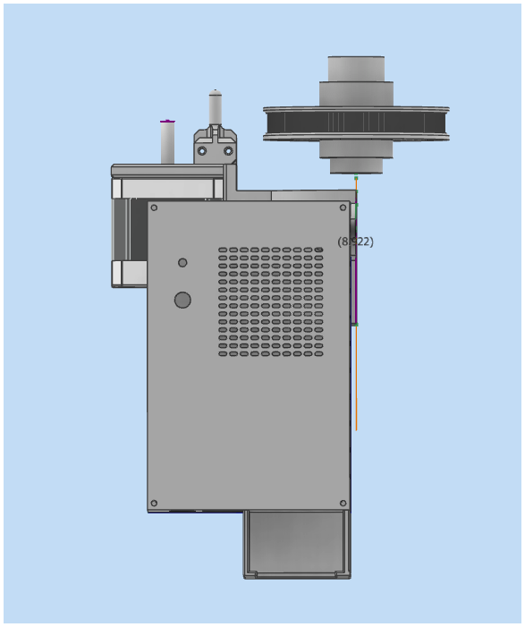
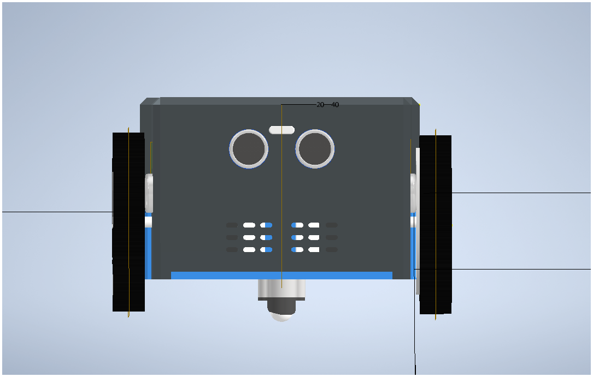
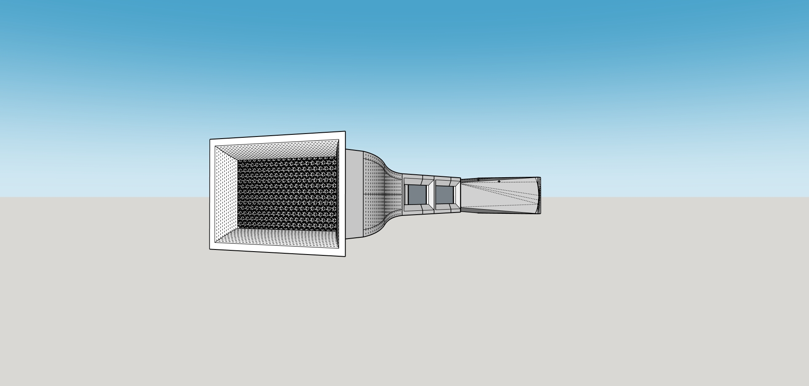

# Elias A. Reyes — Engineering Portfolio

I have hands-on experience in **robotics, swarm dynamics, simulation, and fabrication**.

**Alexandria, VA**  
**Email:** ereyesgo@gmu.edu  
**Phone:** (540) 481-5207

## Education

**George Mason University** — Fairfax, VA  
**B.S. Mechanical Engineering** (Jan 2025 – Present)  
- RISE Scholar (Summer 2025)

**Northern Virginia Community College** — Annandale, VA  
**A.S. Engineering** (Dec 2024)  
- NOVA CORE Scholar  
- S-STEM Scholar (Spring 2024 Cohort)  
- CCAMPIS work-study  
- COVID-19 vaccination campaign volunteer  

---

## Work Experience

**RISE Undergraduate Researcher** — Fairfax, VA (Jan 2025 – May 2025)  
**Motility Induced Phase Separation and Chemotaxis for Swarm Payload Transport**  
- Developed an agent-based model in NetLogo to simulate swarm robotics behavior using Vicsek alignment, chemotactic gradients, and MIPS  

**Fabrication Lab Intern** — Manassas, VA (Aug 2024 – Dec 2024)  
**Northern Virginia Community College**  
- Calibrated and maintained laser cutting equipment  
- Assisted with material preparation, job setup, and job execution  
- Supported supervision and training of other students  

**Engineering Intern** — Fairfax, VA (Summer 2024)  
**Fairfax Water**  
- Recorded operational data from SCADA dashboards across multiple facilities  
- Supported data analysis for an EPA lead reduction initiative  
- Performed walk-through inspections of pump stations  
- Assisted with preventive maintenance of facility sensors  

**Quality Control Foreman** — Largo, MD (Apr 2019 – Dec 2021)  
**Cleveland Construction Inc.**  
- Scheduled repair work and supervised QC crews to meet contract specifications  
- Ordered materials and planned distribution to maintain steady workflow  
- Served as point of contact with county inspectors  
---

## Projects
Welcome to my porfolio! here are some of the projects I have worked on during my time in school.

  <a class="project-card" href="https://eliasreyess.github.io/Swarm-Payload-Transport-Research-project-/">
    
    

      <h3 class="project-title">Emergence in Swarm Systems</h3>
      
Investigated how MIPS and chemotaxis influence swarm dynamics.

      

        NetLogo
        Emergence
        Active Matter Physics
      

    

  </a>

  <a class="project-card" href="https://eliasreyess.github.io/Two-stage-gearbox-desing/">
    
    

      <h3 class="project-title">Two-Stage Gearbox</h3>
      
Design, simulation, and manufacturing of a two-stage gearbox.

      

        MATLAB
        Simulink
        Inventor
      

    

  </a>

  <a class="project-card" href="https://eliasreyess.github.io/Telescope-mount-tracking-retrofit-/">
    
    

      <h3 class="project-title">Telescope Mount Tracking Retrofit</h3>
      
Modernization of a reflector telescope for motorized tracking.

      

        MATLAB
        Simulation
      

    

  </a>

  <a class="project-card" href="https://eliasreyess.github.io/Autonomous-mobile-robot/">
    
    

      <h3 class="project-title">Robotic design</h3>
      
Autonomous cleaning robot capable of enviroment navigation

      

        Embedded Systems
         Raspberi pi
         LIDAR
        ROS2
      

    

  </a>
  <a class="project-card" href="https://eliasreyess.github.io/Small-scale-wind-tunnel/">
    
    

      <h3 class="project-title">Small scale wind tunnel</h3>
      
Manufactured a small scale wind tunnel for flow visualization

      

        Fluid dynamics
         Boundary layer
         Laminar flow
      

    

  </a>

